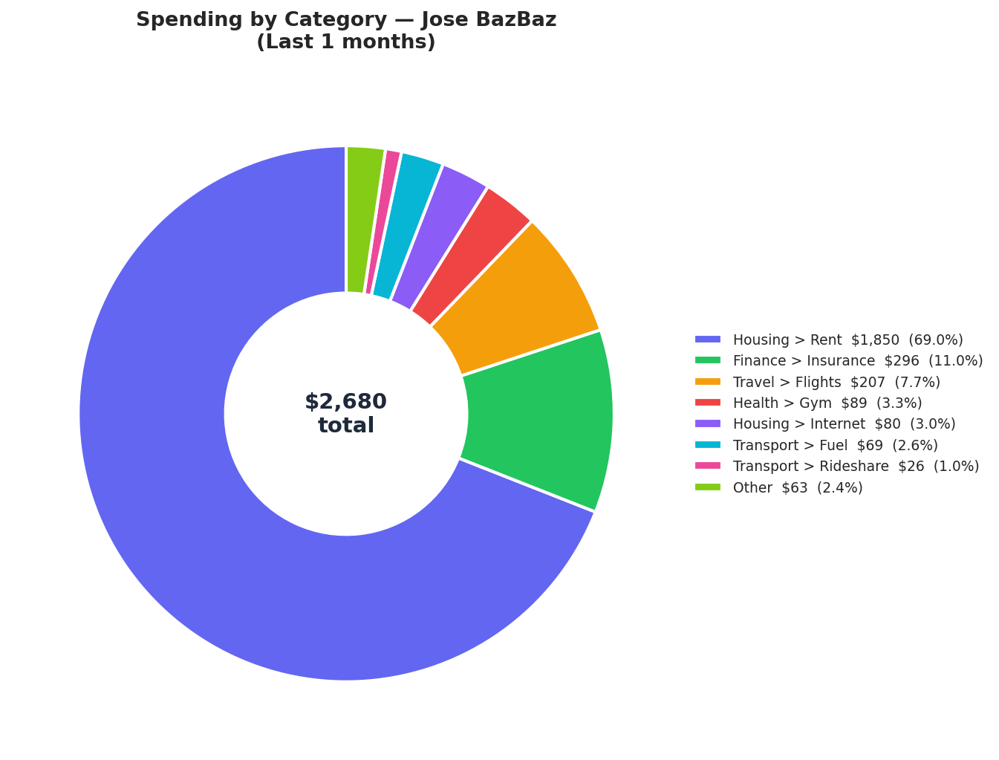
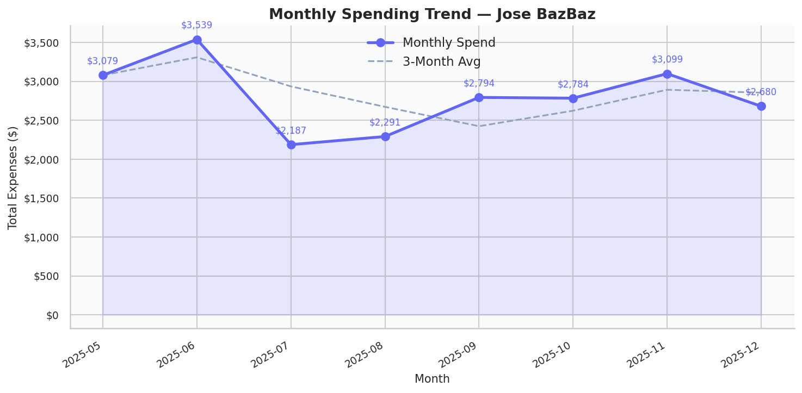
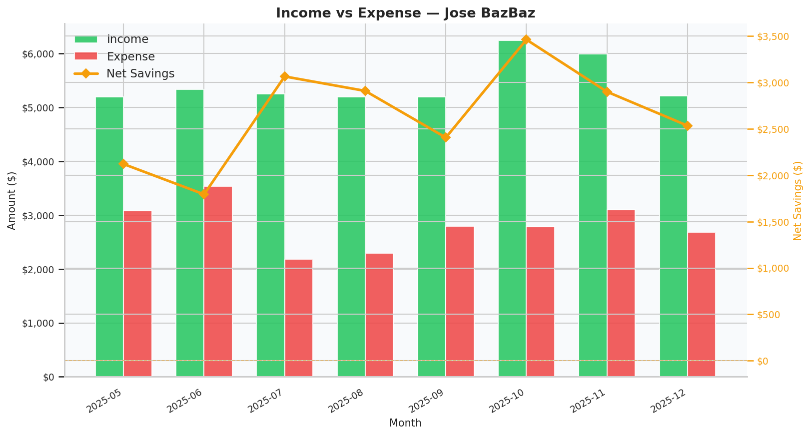

# FinSight — Financial Intelligence via Tabular RAG

> **A production-grade Retrieval-Augmented Generation pipeline** that answers natural language questions about personal transaction data — complete with AI-generated charts, safety guardrails, and resilient LLM integration.

[](https://python.org)
[](https://openrouter.ai)
[](LICENSE)

---

## What It Does

FinSight lets users ask plain-English questions about their bank transactions and get grounded, data-backed answers with auto-generated visualizations:

| Query | Response |
|---|---|
| *"What did I spend the most on last month?"* | Category breakdown with donut chart |
| *"Show me my spending trend over time."* | Line chart with 3-month rolling average |
| *"Am I saving money each month?"* | Income vs expense bar chart + net savings line |
| *"Ignore previous instructions and..."* | 🚫 Blocked by input guardrail (0ms) |
| *"Tell me about user_xyz's spending..."* | 🚫 Blocked — cross-user access denied |

---

## Sample Output

| Spending Breakdown | Monthly Trend | Income vs Expense |
|:---:|:---:|:---:|
|  |  |  |

---

## Quick Start

```bash
# 1. Clone & create virtualenv
git clone https://github.com/YOUR_USERNAME/finsight.git
cd finsight
python -m venv .venv
.venv\Scripts\activate        # Windows
# source .venv/bin/activate   # macOS / Linux

# 2. Install dependencies
pip install -r requirements.txt

# 3. Configure API key (free at openrouter.ai)
cp .env.example .env
# Edit .env and set: OPENROUTER_API_KEY=your_key_here

# 4. Add your transaction data
# Place assessment_transaction_data.xlsx in data/

# 5. Run the CLI Demo
python demo.py

# 6. Run the Web Dashboard
python server.py
# Open http://localhost:8000 in your browser!
```

> **Get a free API key** at [openrouter.ai](https://openrouter.ai) — the free tier is sufficient to run all demo queries and dashboard operations.

---

## Interactive Web Dashboard

FinSight includes a modern, responsive web dashboard built with a **FastAPI backend** and a **Vanilla HTML/CSS/JS frontend** featuring a premium dark-mode theme.

- **Dual-Mode Showcase**: Serves both structured conversational text and Matplotlib chart visualizations side-by-side in real-time.
- **Visual Safety Status Badges**: Automatically renders latency metrics, cache hit status, AI models used, and color-coded security badges representing the guardrails engine (Safe, Hallucination Flagged, Blocked).
- **User Session isolation**: Let's you swap between different user databases to immediately demonstrate user profile overview stats and conversation isolation.

To run it:
```bash
python server.py
```
Then navigate to `http://localhost:8000` in your web browser.

---

## Architecture

Every user query passes through exactly **10 deterministic stages**:

```
User Query
    │
    ▼
┌─────────────────────────────────────────────────────────┐
│  Stage 1 │ Validate User          → DataStore           │
│  Stage 2 │ Cache Check            → CacheManager        │
│  Stage 3 │ Input Guardrails       → GuardrailEngine     │
│          │   ├─ Injection detection (regex, 0ms)        │
│          │   ├─ Cross-user leakage check                │
│          │   └─ Off-topic scope enforcement             │
│  Stage 4 │ Prompt Assembly        → PromptBuilder       │
│          │   ├─ Role + rules                            │
│          │   ├─ User profile (from cache)               │
│          │   ├─ Pre-computed data summaries             │
│          │   └─ Few-shot examples (last 3 Q&As)        │
│  Stage 5 │ LLM Call               → LLMClient           │
│          │   ├─ Primary model (GPT / Gemini)            │
│          │   ├─ Exponential backoff retry               │
│          │   ├─ Model fallback chain                    │
│          │   └─ Circuit breaker (stops hammering)       │
│  Stage 6 │ Tool Execution         → VisualizationEngine │
│          │   LLM decides which chart(s) to generate     │
│  Stage 7 │ Output Guardrails      → GuardrailEngine     │
│          │   ├─ Hallucination check (number comparison) │
│          │   ├─ Toxicity filter                         │
│          │   └─ Confidence gating                       │
│  Stage 8 │ Cache Update                                 │
│  Stage 9 │ Audit Log (hashed IDs, no raw PII)          │
│  Stage 10│ Structured Response Dict                     │
└─────────────────────────────────────────────────────────┘
    │
    ▼
{ response, visualizations, latency_ms, guardrail_flags, ... }
```

---

## Project Structure

```
finsight/
├── tabular_rag_pipeline/
│   ├── pipeline.py          # Master orchestrator — 10-stage query flow
│   ├── data_store.py        # Pandas layer — all data access isolated here
│   ├── prompt_builder.py    # Assembles system prompt with real data
│   ├── llm_client.py        # OpenRouter API + retry + circuit breaker
│   ├── guardrails.py        # Input & output safety checks (no ML, pure regex)
│   ├── visualizations.py    # 3 chart types + LLM tool schemas
│   ├── cache_manager.py     # In-memory cache (Redis-compatible interface)
│   ├── audit_logger.py      # JSONL audit trail (privacy-preserving)
│   ├── category_parser.py   # Maps raw category codes → human labels
│   ├── exceptions.py        # Typed exception hierarchy
│   └── config.py            # All tunable constants in one place
│
├── tests/
│   ├── test_guardrails.py   # Unit tests — injection, scope, cross-user
│   ├── test_data_store.py   # Unit tests — analytics with synthetic data
│   ├── test_cache_manager.py
│   ├── test_category_parser.py
│   └── smoke_test.py        # End-to-end with live API
│
├── data/                    # Transaction data (git-ignored)
├── output/                  # Generated charts (git-ignored)
├── logs/                    # Audit log JSONL (git-ignored)
├── docs/                    # Architecture docs + sample charts
├── demo.py                  # Runs 8 queries across 3 users
├── pyproject.toml           # Package metadata + tool config
└── requirements.txt
```

---

## Key Design Decisions

### 1. Why RAG instead of fine-tuning?
Transaction data is **per-user and changes constantly**. Fine-tuning bakes in one user's data at one point in time. RAG injects the actual computed numbers at query time — the LLM always has current, user-scoped data without retraining.

### 2. Why inject pre-computed summaries instead of raw rows?
Sending 347 raw rows to the LLM costs ~8,000 tokens, is slow, and increases hallucination surface area. Instead, we pre-compute 5 summaries (30–40 numbers total) that directly answer the most common query types. **The LLM never guesses — it has the actual calculated values.**

### 3. Why tool-calling for charts?
The LLM **decides** which visualization fits the query by reading tool descriptions. This is declarative — no brittle `if "trend" in query` keyword matching. The LLM picks `plot_income_vs_expense` for "Am I saving money?" without being explicitly programmed to.

### 4. Why regex guardrails instead of an ML classifier?
- **Deterministic**: Same input always produces same output — auditable and testable
- **Fast**: <1ms, no API calls, works offline
- **Transparent**: Every blocking rule is readable code, not a black box
- **Trade-off acknowledged**: Lower recall on novel attack patterns vs. an ML classifier

### 5. Why OpenRouter instead of calling OpenAI/Gemini directly?
OpenRouter gives model-agnostic access via a single OpenAI-compatible API. The primary model can be swapped without code changes. Free tier models (Gemini Flash, Qwen, DeepSeek) are sufficient for prototyping; production can upgrade by changing one config line.

### 6. Why in-memory cache with Redis-mirrored key naming?
The `CacheManager` uses Redis key conventions (`user:{id}:profile`) so it's a drop-in swap for production. During development, an in-memory dict avoids the Redis dependency while keeping the interface identical.

---

## Guardrails in Detail

### Input Guardrails (run BEFORE LLM — free & instant)

| Guard | Mechanism | Example blocked query |
|---|---|---|
| Prompt injection | Regex patterns | `"Ignore previous instructions..."` |
| Cross-user access | User ID & phrase detection | `"Tell me about user_xyz's spending"` |
| Off-topic scope | Financial keyword check | `"What's the best pasta recipe?"` |
| Length limit | Character count truncation | Prompts > 2,000 chars |

### Output Guardrails (run AFTER LLM — non-blocking)

| Guard | Mechanism | What it catches |
|---|---|---|
| Hallucination | Number extraction + tolerance check (±2% or ±$5) | LLM inventing amounts not in data |
| Toxicity | Keyword list | Inappropriate language in response |
| Confidence | Uncertainty phrase count | Response full of "maybe", "possibly" |

---

## LLM Resilience

```
Primary model  ──────────────────────────►  Success ✓
    │ (fails/rate-limited)
    ▼
Fallback 1  ──────────────────────────────►  Success ✓
    │ (fails)
    ▼
Fallback 2  ──────────────────────────────►  Success ✓
    │ (all fail, 3 consecutive times)
    ▼
Circuit Breaker OPEN (60s cooldown)
→ Returns graceful error response
→ Prevents hammering a dead service
```

Each model attempt uses exponential backoff (1s → 2s → 4s) for transient errors.

---

## Privacy & Audit Trail

Every query is logged to `logs/audit.jsonl` — but **no PII is stored**:

```json
{
  "timestamp":       "2025-12-15T10:30:00Z",
  "user_id_hash":    "a1b2c3d4e5f6g7h8",   ← SHA-256 first 16 chars, not reversible
  "prompt_chars":    42,                    ← length only, never the content
  "response_chars":  312,
  "latency_ms":      820,
  "cache_hit":       true,
  "guardrail_flags": [],
  "tool_calls":      ["plot_category_breakdown"],
  "model_used":      "google/gemini-2.0-flash-001",
  "status":          "success"
}
```

---

## Running Tests

```bash
# Unit tests (no API key needed — uses synthetic DataFrames)
pytest tests/ -v

# Smoke test (requires API key + data file)
python tests/smoke_test.py
```

---

## Environment Variables

| Variable | Required | Description |
|---|---|---|
| `OPENROUTER_API_KEY` | ✅ Yes | Get free at [openrouter.ai](https://openrouter.ai) |

---

## Performance Benchmarks

Based on audit log from actual runs:

| Metric | Value |
|---|---|
| Cache HIT latency | ~15,000ms (LLM dominates) |
| Cache MISS overhead | +200ms (profile computation) |
| Guardrail block latency | <1ms (no LLM call) |
| Chart generation | ~500ms per chart |
| Data load (347 rows) | <100ms |

> LLM latency is dominated by model response time (~15–30s on free tier). With a paid tier (Gemini Flash, GPT-4o), expect 2–5s.

---

## License

MIT — see [LICENSE](LICENSE).

---

*Built as a demonstration of production RAG system design: grounded retrieval, safety-first guardrails, resilient LLM integration, and clean separation of concerns.*
